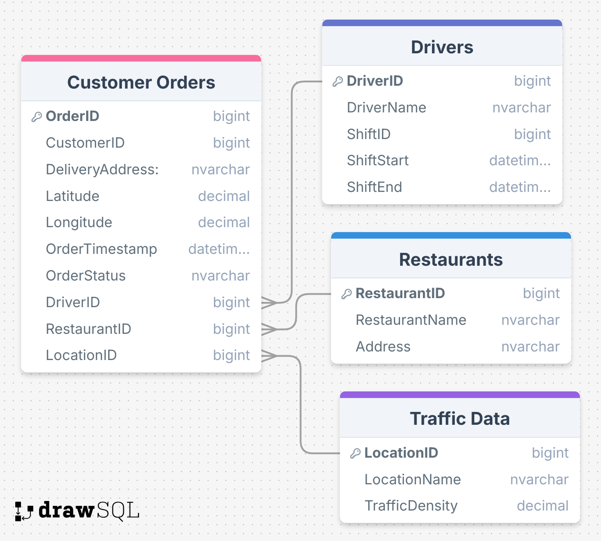

# 🚗 UrbanEats Route Optimization – Data Analytics Project
## **Improving Delivery Efficiency for Food Delivery Services in Dense Urban Areas**

---

# 📖 Project Background

UrbanEats is a food delivery company operating in high-density urban areas since 2016. Its business model revolves around on-demand food delivery, supported by a fleet of independent drivers. While the company has grown significantly in terms of market share and customer reach, challenges around delivery efficiency, rising operational costs, and customer satisfaction persist.
As a Data Analyst, I was tasked with diagnosing key operational inefficiencies using SQL and Power BI, and recommending data-driven solutions to improve performance.

---

Insights and recommendations are provided on the following key areas:
- Delivery Lead Times
- Operational Costs
- Driver Allocation & Performance
- Customer Experience

The SQL queries used to inspect and clean the data for this analysis can be found here → [Route_Optimization_for_Food_Delivery.sql](./Route_Optimization_for_Food_Delivery.sql)
Targeted SQL queries used to answer specific business questions can be found here → [Route_Optimization_for_Food_Delivery.sql](./Route_Optimization_for_Food_Delivery.sql)
An interactive Power BI dashboard used to visualize performance and test scenarios can be found here → [Delivery_Ooptimization_Dashboard](https://app.powerbi.com/groups/me/reports/d596a82c-b9d9-4ecf-94dd-984edce9583f?ctid=319a61c8-ee1e-4161-8f35-b9553227afd7&pbi_source=linkShare&bookmarkGuid=2c52c005-ae0f-44e4-bc7e-56c3931703fe) 

---

# 📂 Data Structure & Initial Checks
The main database for this project consisted of four tables with a combined total of ~50,000 rows.
-	CustomerOrders – Order IDs, timestamps, delivery addresses, customer satisfaction ratings.
-	Drivers – Driver IDs, shift schedules, completed deliveries, and performance metrics.
-	TrafficData – Road segments, time-of-day traffic intensity, congestion indexes.
-	Restaurants – Vendor IDs, prep times, and average turnaround times.
#### The relationships across the tables can be visualized in the following Entity Relationship Diagram (ERD):

---

# 📊 Executive Summary
## Overview of Findings
UrbanEats operates in a fast-paced, high-demand industry where efficient food delivery is essential to both customer retention and sustainable business growth. However, the company faces pressing challenges: prolonged delivery times, escalating operational costs, inaccurate delivery estimates, and high driver dissatisfaction.
#### The analysis revealed three key insights:
1.	Peak-hour traffic (especially around 7 a.m.) is the largest contributor to delays.
2.	Restaurant-level inefficiencies significantly extend delivery times for specific vendors.
3.	Uneven driver allocation during peak periods results in high backlog rates and missed service opportunities.
#### This project introduces a data-driven route optimization framework designed to enhance delivery efficiency in dense urban environments. Leveraging SQL for data analysis and Power BI for visualization and decision support, the project aims to achieve:
-	A 20% reduction in delivery lead times.
-	A 15% decrease in operational costs.
-	Improved driver satisfaction through fairer, less stressful route planning.
-	Enhanced customer experience via accurate, real-time order updates.
#### Successful implementation of these strategies will not only address current inefficiencies but also position UrbanEats as an industry leader in urban food delivery logistics. This initiative represents a strategic investment in technology-enabled efficiency, ensuring that UrbanEats maintains a competitive edge while delivering exceptional service.

---

# 🔍 Insights Deep Dive

### **Delivery Lead Times**
-	**High Pending Orders:** Out of 1,000 total orders, 653 (65%) remain pending, signaling a major bottleneck in order fulfillment.
-	**Average Delivery Time:** Average delivery time is 9.35 minutes, which looks efficient, though it only reflects completed orders and may hide delays in pending ones.
-	**Delivery Performance by Hour:** Peak delays occur around 7 AM, aligning with both high order volume and rush-hour traffic.
-	**Restaurant Delays:** Nguyen-Lopez records the highest delivery time (~4 mins), while others like Green, Malone, and Peterson show faster turnaround.

### **Operational Costs**
-	**Traffic Hotspots:** Congested areas such as Hell’s Kitchen, Gramercy, and Gashouse District increase delivery times and fuel costs, driving up overall operational expenses.
-	**Order Trends by Weekday:** Highest order days are Wednesday (176) and Thursday (167), which, if not managed with proper resourcing, spike costs due to overtime and inefficient routing.
  
### **Driver Allocation & Performance**
-	**Top Drivers:** Thomas McDonald handles the highest number of orders (36), showing strong performance but also possible over-allocation risk.
-	**Workload Distribution:** Driver shifts range from 6 to 8 per period, with Dawn Ferguson and Michelle Ballard at the max (8 shifts) and Cynthia Vasquez and Jennifer Williams at the min (6 shifts).
-	**Drivers with Most Delay:** Brian Osborne averages 0.26 hrs (~15.6 mins) delay, indicating inefficiency or challenging routes.
-	**Drivers with Least Delay:** Anthony Hawkins, Adam Delon, and Jacqueline Chan perform efficiently with delays as low as 0.10 hrs (~6 mins).

### **Customer Experience**
-	**Pending Orders Impact:** The 65% pending rate undermines reliability, leading to dissatisfaction and possible churn.
-	**Top Restaurants:** Nguyen-Lopez and Ryan, Alexander, and Willis generate the highest order volumes, meaning inefficiencies here directly affect more customers.
-	**Real-Time Accuracy:** Inaccurate or delayed estimates from bottlenecks and traffic zones reduce customer trust and repeat usage.

---

# Recommendations:
Based on the insights and findings above, we would recommend the [stakeholder team] to consider the following: 

*	Investigate the root cause of the 65% pending orders (possible dispatching delays or insufficient workforce).
*	Optimize staffing and delivery resources to handle Wednesday/Thursday peaks effectively.
*	Avoid dispatching during 7 AM traffic peaks; reroute deliveries via less congested zones.
*	Use historical traffic data to dynamically optimize routes, reducing both delivery time and fuel costs.
*	Support high-volume restaurants like Nguyen-Lopez with additional delivery capacity or efficiency tools to reduce costly bottlenecks.
*	Redistribute shifts more evenly to balance workload, prevent burnout, and increase driver engagement.
*	Investigate drivers with consistently higher delays (e.g., Brian Osborne) to identify whether route allocation or shift timing is the issue.
*	Recognize and reward low-delay drivers (Anthony Hawkins, Adam Delon, Jacqueline Chan) to encourage best practices and morale.
*	Improving real-time delivery accuracy through dynamic routing and workforce optimization to increase trust and retention.
*	Reduce pending order volume at high-demand restaurants, directly improving customer satisfaction for the largest customer segments.

---

# Assumptions and Caveats:

### Throughout the analysis, multiple assumptions were made to manage challenges with the data. These assumptions and caveats are noted below:
-- **Assumption 1:** The TimeTakenToDeliver column was found to contain incorrect values. To ensure data reliability, a new column for delivery time was calculated using the difference between the OrderTimestamp and DeliveryTime columns, and the original TimeTakenToDeliver column was dropped.
- **Assumption 2:** The DeliveryHours column contained invalid values for pending deliveries. To rectify this, a new, calculated DeliveryHours column was added to the dataset.
  
---

# 📚 Project Files

- [Route_Optimization_for_Food_Delivery.sql](./Route_Optimization_for_Food_Delivery.sql) → Main SQL analysis & optimization script  
- Power BI Dashboard → [Delivery_Ooptimization_Dashboard](https://app.powerbi.com/groups/me/reports/d596a82c-b9d9-4ecf-94dd-984edce9583f?ctid=319a61c8-ee1e-4161-8f35-b9553227afd7&pbi_source=linkShare&bookmarkGuid=2c52c005-ae0f-44e4-bc7e-56c3931703fe) 

---

# 🤝 Acknowledgements

Thanks to Amdari.io for enabling this analysis.

---

# 💬 Contact

For questions, feedback, or collaboration opportunities, feel free to connect!

---
